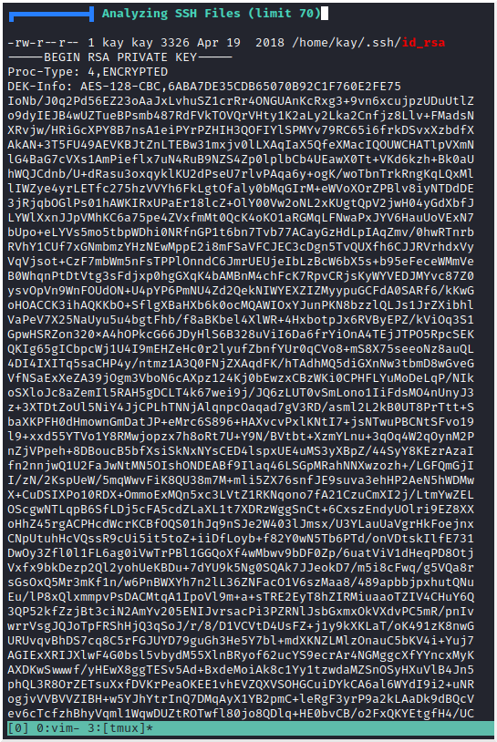

# Basic Pentesting
Target IP: 10.10.148.176 

### Description:

This is a machine that allows you to practice web app hacking and privilege escalation.</br>
In these set of tasks you'll learn the following:
- brute forcing 
- hash cracking 
- service enumeration
- Linux Enumeration

## Web App Testing and Privilege Escalation
#### Find the services exposed by the machine.
To do this we will use **nmap** to scan all ports on the machine, and then use nmap again to run a few default scripts against the identified open ports to have more information on the services, for example the service's version.

[nmap.out](./nmap.out)


[nmap_ext.out](./nmap_ext.out)

We can see that we have SSH, which means that if we find some credentials or private keys, we may be able to get into the machine with a good shell, instead of a reverse/bind shell that are more unstable. Port 80 is also open and is probably our way into the machine, thus the place we want to start, since there's a lot of vulnerabilities that web apps can have. Speaking of web apps, there's also port 8009 and 8080 with web apps running, port 8080 is normal to run Apache Tomcat, but 8009 is an unconventional port to use. Moreover we know that this machine provides SMB services.

#### Answer: ````No answer needed````

#### What is the name of the hidden directory on the web server(enter name without /)? 
To be able to answer this question, we can fuzz the web directory using **GoBuster**:
````
gobuster - program to run
dir - fuzz directories
-u - url
-w - wordlist file 
-o output file
````

[gobuster.out](./gobuster.out)

We found one directory, *development*, let's access it:


The directory has two files: *dev.txt* and *j.txt*  
**dev.txt**:

</br>
**j.txt**:</br>


From here we can see that we have two users one that starts with K and another with J. We also learn that K is playing around with non-updated software, and J has a weak password,  which is worth keeping in mind.

From struts [website](https://struts.apache.org/):</br>
**Struts** - "Apache Struts is a free, open-source, MVC framework for creating elegant, modern Java web applications. It favors convention over configuration, is extensible using a plugin architecture, and ships with plugins to support REST, AJAX and JSON. "

#### Answer: ````development````

#### User brute-forcing to find the username & password
To find the username and password by brute forcing, first we need a wordlist with usernames and another with passwords. For the passwords we can use the **rockyou.txt** wordlist, that in Kali machines is on */usr/shar/wordlists*. For the usernames, we will use a file that also comes pre-installed with kali and is on */usr/share/wfuzz/wordlist/others* and we take the only the users that start with j or k.
```
grep -E "^[JjKk]" names.txt > j_k_users.txt
```

To brute force we will use the tool **Hydra** and run it against the target's SMB service.
This method wasn't successful, so we tried running it against SSH and the result was the same. But, remember that early I said that SMB was a good point for enumeration? Let's see if we can log in anonymously into SMB and luckly get some information:

First we listed the shares (-L), then we accessed the share called *Anonymous*, we listed its files and finally downloaded *staff.txt* to our machine so we could read it.

Note: the password is left in blank.
#### Answer: ````No answer needed````

#### What is the username? 
We got two users: Jan and Kay, and we know that our user Jan has a weak password from the message Kay left him on the web server, thus he must be our guy.

#### Answer: ````Jan````

#### What is the password? 
We can try *Hydra* again with the user Jan, and just brute force the password.

hydra command syntax: ````hydra -t no_threads -l user -P file_with_passwords IP_Address Service````


#### Answer: ````armando````

#### What service do you use to access the server(answer in abbreviation in all caps)?

#### Answer: ````SSH````

#### Enumerate the machine to find any vectors for privilege escalation.
We're going to use [linpeas.sh](https://github.com/carlospolop/PEASS-ng/releases/latest/download/linpeas.sh) for this part. LinPEAS is a script that enumerates the linux machine in order to find vectors for privilege escalation.
First we need to transfer the file to our target machine, so in our Kali machine we run:
```
scp linpeas.sh jan@10.10.140.97:/tmp
```

Then we need to give the file executable permissions, and finally run it:
```
chmod +x linpeas.sh
./linpeas.sh
```
Viewing the output of the script, we found the user **Kay**, and that they belong to the *sudo* group. We also found their ssh private key:

</br>


#### What is the name of the other user you found(all lower case)? 
#### Answer: ````kay````

#### If you have found another user, what can you do with this information? 
#### Answer: ````No answer needed````

Now we just need to get the *id_rsa* file on our machine and log in via SSH into Kay's account.
Unluckily the key is protected with a passphrase. But if this passphrase is weak we can format the key into a hash using **ssh2john** and then find the passphrase using **john**:


The passphrase is: beeswax

Now we can log in as kay and get their password.


#### What is the final password you obtain? 
#### Answer: ````heresareallystrongpasswordthatfollowsthepasswordpolicy$$````
