# Pickle Rick

**Description**: This Rick and Morty themed challenge requires you to exploit a webserver to find 3 ingredients that will help Rick make his potion to transform himself back into a human from a pickle.

**Target machine**: 10.10.67.35

## Quick enumeration
We start by finding what ports are open:
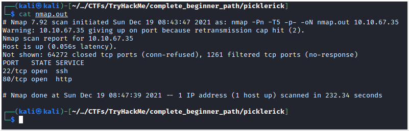

Typically SSH is not vulnerable and we don't have any credentials, so we will start by enumerating port 80.
First step is to go to the webpage:
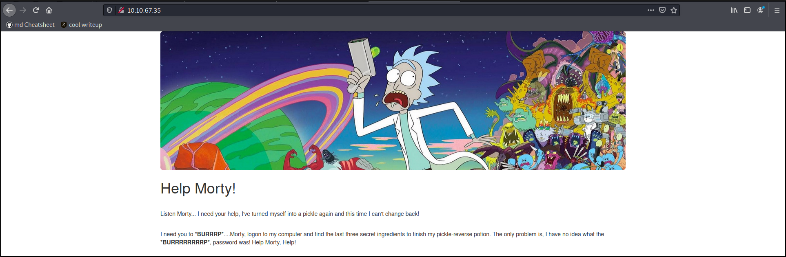

Looks like we need to find some credentials. And what better place than the source code?
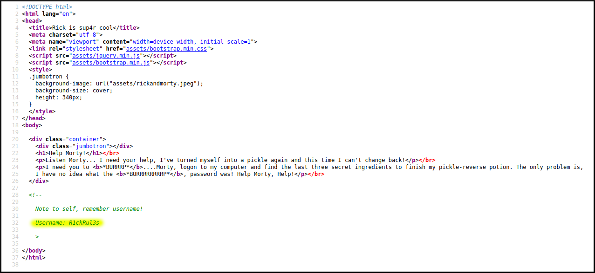

Ok, we have the username. But what about the password?
Let's do a directory brute force to see if there are other pages laying around that can contain the password:
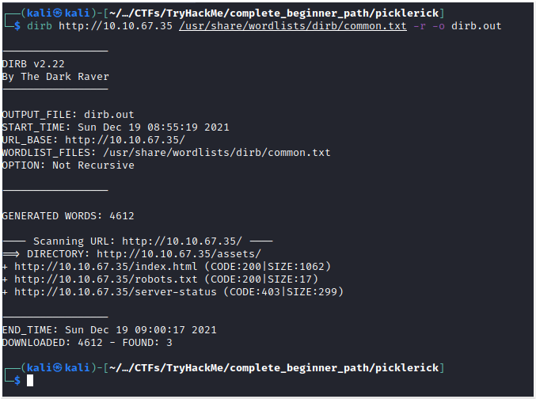

robots.txt looks interesting:
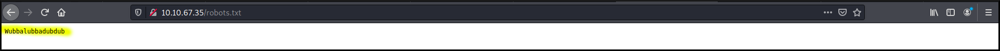
This seems exactly the password that our friend Rick would use. (If you don't know what *wubalubadubdub* means, you can see it [here](https://www.urbandictionary.com/define.php?term=wubalubadubdub))
</br>

We tried using the credentials on the SSH service, unfortunately they didn't work. So this credentials are used somewhere on the website. We need to enumerate the website a little more.
```
dirb http://10.10.67.35 /usr/share/wordlists/dirb/common.txt -r -X .js,.php,.html -o dirb_ext.out
```
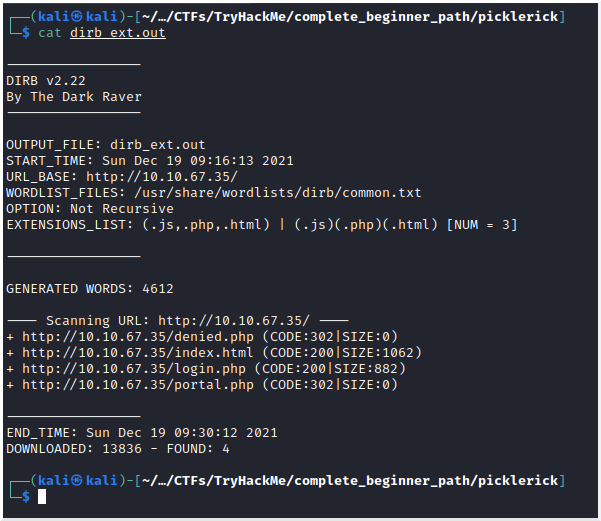
Bingo, login.php

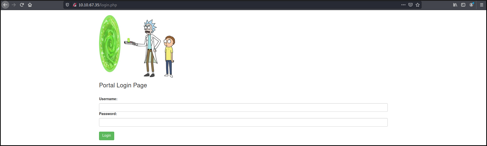
Now if we try our credentials, we are able to log in and we are reddirected to *portal.php* page.

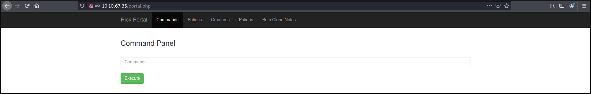
It looks like we can execute commands.

Let's try our hypothesis with ````id; whoami; ls````:
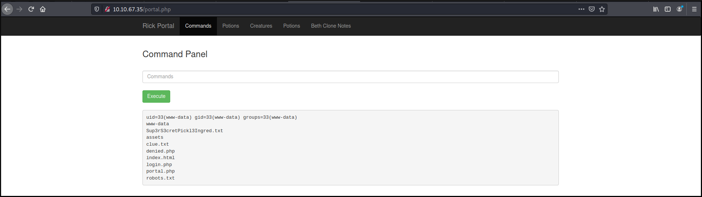

Great, we have a webshell, a clue, and a file that probably contains our first ingredient.
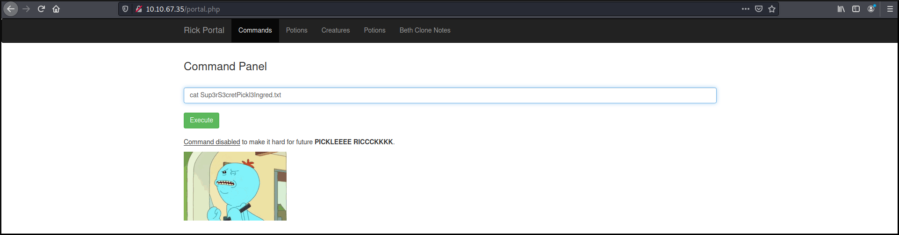

Oh, no! Looks like ````cat```` is disabled, so we need to find another way to read the file.
</br>
Since the file is in the same directory as our webpage, we can just browse to it:
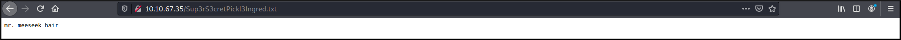

Another way would be to use the command ````less```` for example.

Whoop! Whoop! We got our first ingredient!!! Only two more to go, but where do we go from here?
1. We could create a reverse shell to be more easy to navigate. (Today we're not going that way)
2. Did you forget that there was a *clue.txt* file when we enumerated the directory?

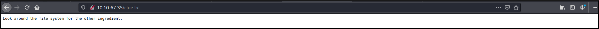

OK, so the normal place for personal files would be in the */home* directory, if we go there we can see the user *rick*, and inside, a file with our second ingredient. Unfortunately, this file isn't in the same directory as our webpage, thus we can't navigate to it. Luckily we discovered 2 solutions to the problem, we can use ````less````:</br>
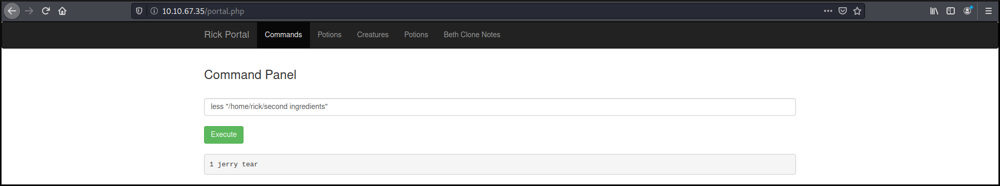

If you have done a few CTFs you can recognize the pattern that we're following. First we looked for a way into the box, second we enumerated the box and now the only stage that is left is no other than *privile escalation*
</br>
Let's start to see what privileges our user has:</br>
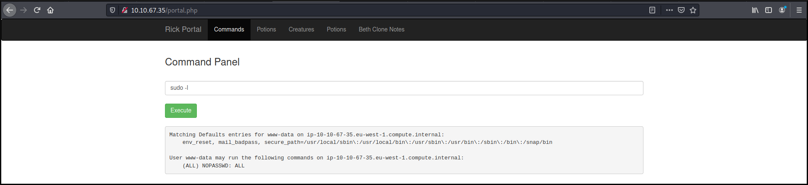

Wow, this is fantastic (for us the attackers ;) ) ````(ALL)```` users don't need password ````NOPASSWD```` to execute ````ALL```` commands. 
<br>
Thus, we can for example enumerate the */root* directory:</br>
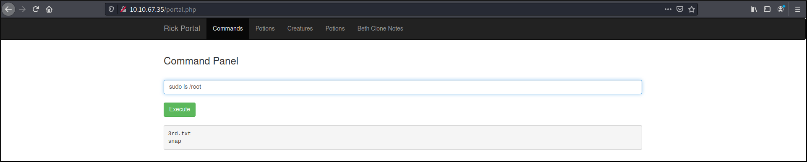

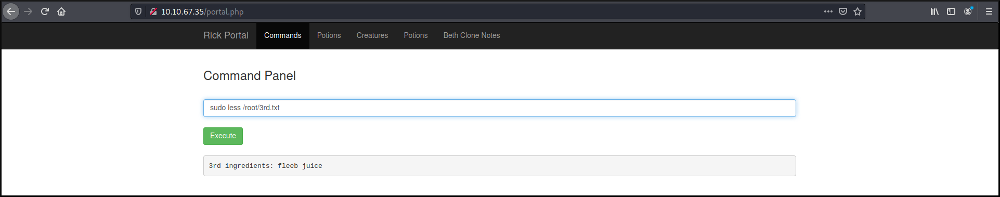
And boom, we got our third and last ingredient to transform Rick back to a human.
 
