# Steel Mountain
Target IP: 10.10.180.195

### Description:
Hack into a Mr. Robot themed Windows machine. Use metasploit for initial access, utilise powershell for Windows privilege escalation enumeration and learn a new technique to get Administrator access. 

## Introduction
#### Who is the employee of the month?
We will start our process like always. An nmap scan.
```
nmap -T5 -sC -sV -p- -oN nmap.out 10.10.180.195
```
[nmap](./nmap.out)

Let's start with port 80:

We are met with a static page, that shows us who is the employee of the month, but only how he looks like, not he's name. We can view the source code to search for any clues.</br>
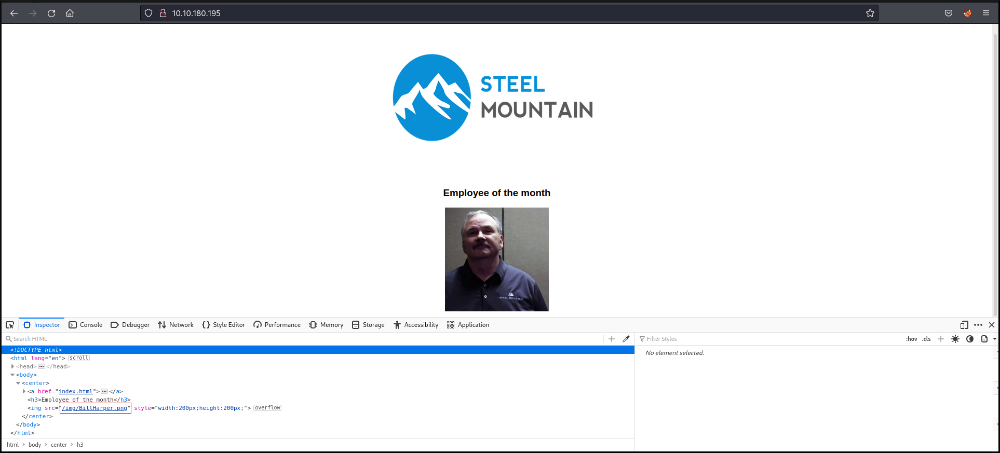

We found the name of the employee in the image's url.

#### Answer: ````Bill Harper````

## Initial access
#### Scan the machine with nmap. What is the other port running a web server on?
As well as port 80, port 8080 is also running an HTTP service. Ports 5985 and 47001 gives us a 404 (Not found) status code.
#### Answer: ````8080````

#### Take a look at the other web server. What file server is running?
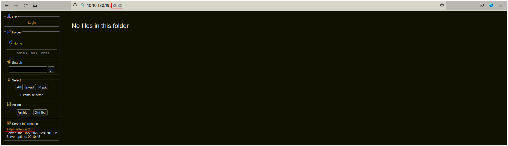

We can click on the hyperlink "HttpFileServer 2.3" under the "Server information" section, and we are sent to [http://www.rejetto.com/hfs/](http://www.rejetto.com/hfs/), though the name isn't just "HTTP File Server", is "Rejetto HTTP File Server"
#### Answer: ````Rejetto HTTP File Server````

#### What is the CVE number to exploit this file server?
[exploit-db](https://www.exploit-db.com) is a database of exploits to known vulnerabilities. We're going to use it to see if there are any exploits that suits us. Remember that we want an exploit for "Rejetto HTTP File Server" version 2.3. So we enter "rejetto" in the search bar:</br>
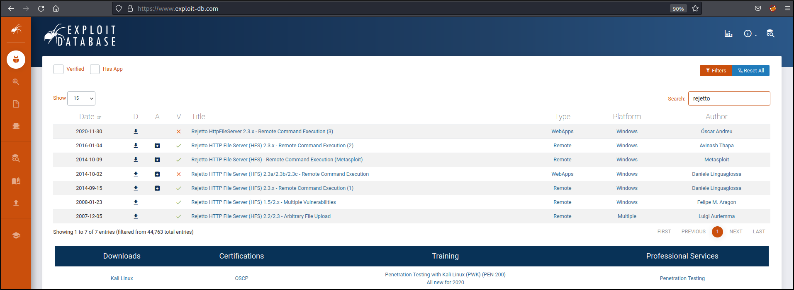

Looks like this version is vulnerable to Romote Code Execution (RCE), click in one of them for more information.</br>
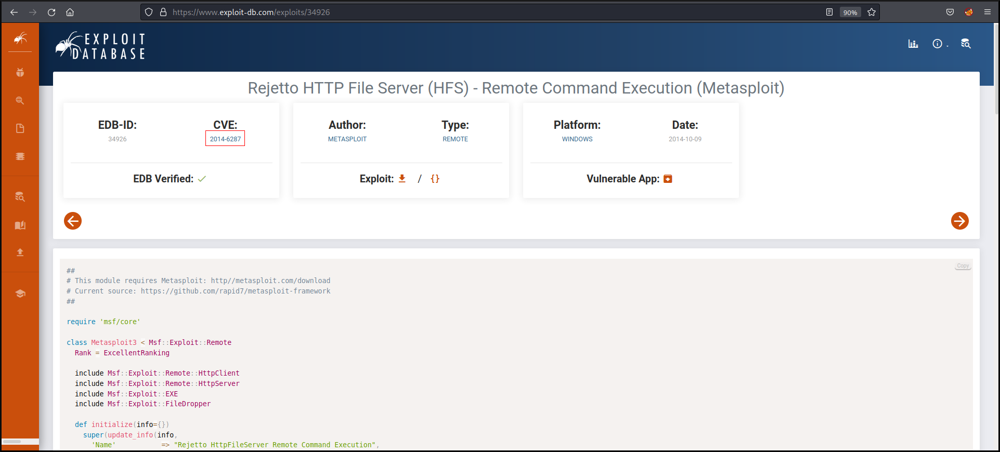

#### Answer: ````2014-6287````

#### Use Metasploit to get an initial shell. What is the user flag?
Open Metasploit, then search for a exploit for rejetto. Use the *rejetto_hfs_exec* exploit and show the options needed to run the exploit:</br>
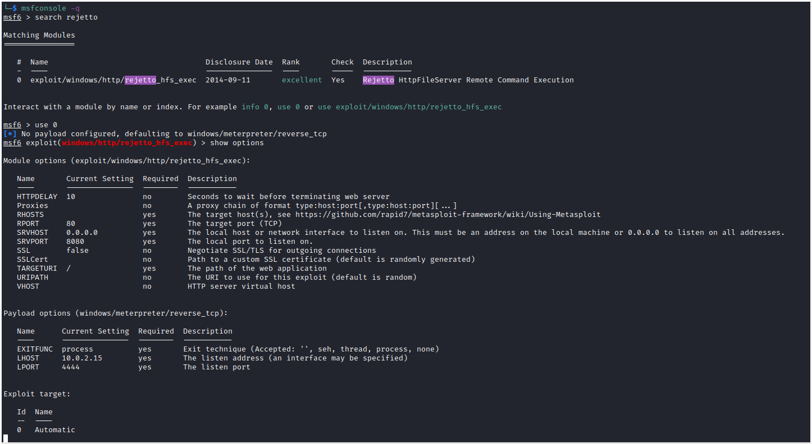

We need to set the options, RHOSTS, RPORT and if necessary LHOST. Then we can run the exploit:</br>
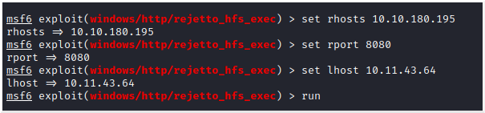

After waiting a few seconds we have a meterpreter reverse shell where we can search for the file *user.txt* on the target and then read it.</br>
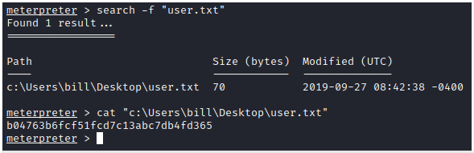

#### Answer: ````b04763b6fcf51fcd7c13abc7db4fd365````

## Privilege Escalation
Now for the privilege escalation part we will use [PowerUp.ps1](https://github.com/PowerShellMafia/PowerSploit/blob/master/Privesc/PowerUp.ps1), which is a powershell script that is part of the PowerSploit Framework (set of scripts for post-exploitation), to look for privilege escalation vectors that rely on misconfiguration.

First we need to upload the script to the target machine on a place where we have write permission, in this case it'll be bill's desktop directory, secondly we need to load powershell onto meterpreter to run the script. The command *Invoke-AllChecks* is used to run all the current checks for Windows privilege escalation vectors.</br>
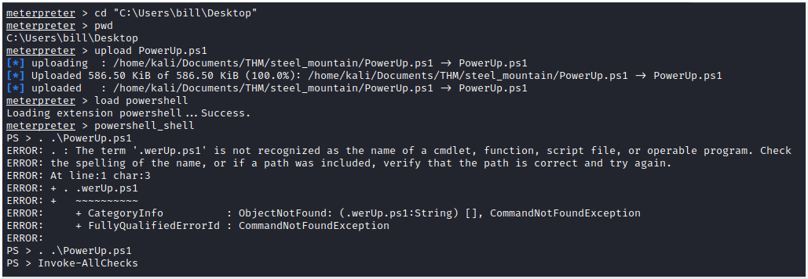

#### Take close attention to the CanRestart option that is set to true. What is the name of the service which shows up as an unquoted service path vulnerability?
Looking at the output:</br>

#### Answer: ````AdvancedSystemCareService9````

The CanRestart option being true, allows us to restart a service on the system, the directory to the application is also write-able. This means we can replace the legitimate application with our malicious one, restart the service, which will run our infected program!

We will create our malicious payload with **msfvenom**, and then do what is says above:</br>
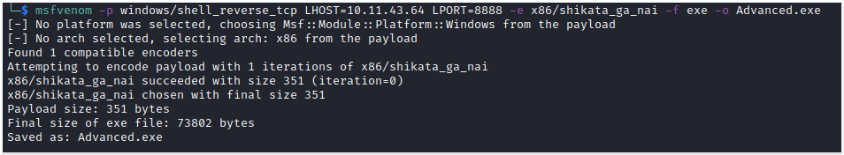

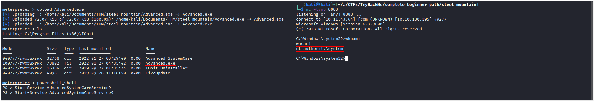

#### What is the root flag?
The root flag is at root's desktop.</br>
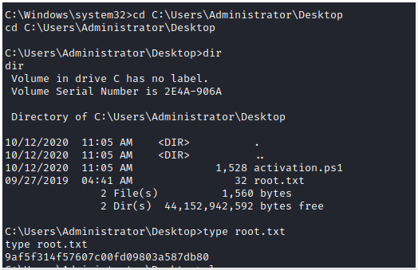
#### Answer: ````9af5f314f57607c00fd09803a587db80````

## Access and Escalation Without Metasploit
For this we will use an [exploit](https://www.exploit-db.com/exploits/39161) that we saw before at exploit-db without being the Metasploit one. We will also need netcat for windows to be able to get a reverse shell. We'll run the exploit twice. The first time the exploit will upload the netcat to the target (note that we will need a web server running on port 80). The second time the exploit will execute our payload and give us a reverse shell on port 8888.</br>
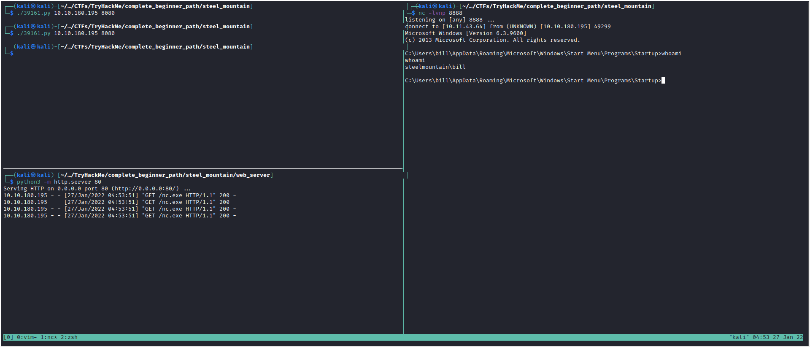

The privesc part can be done as previously.

#### What powershell -c command could we run to manually find out the service name? *Format is "powershell -c "command here"* 
#### Answer: ````powershell -c "Get-Service"````
