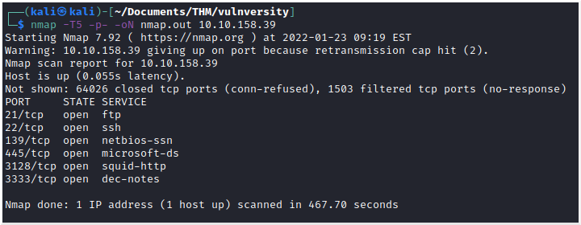
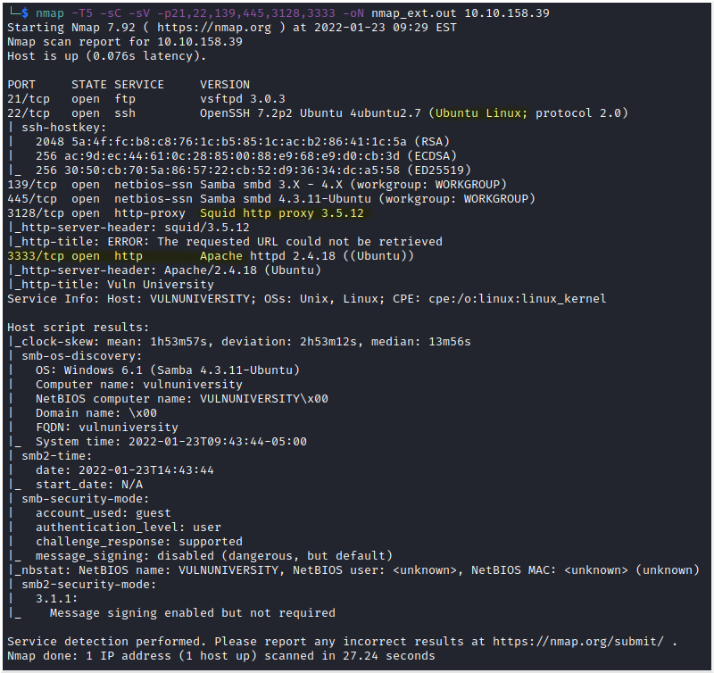
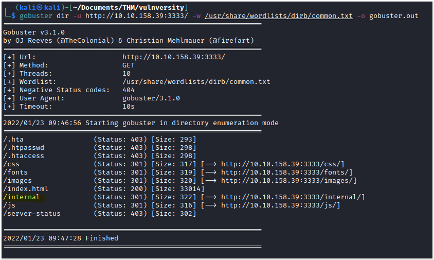
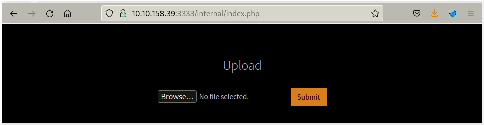
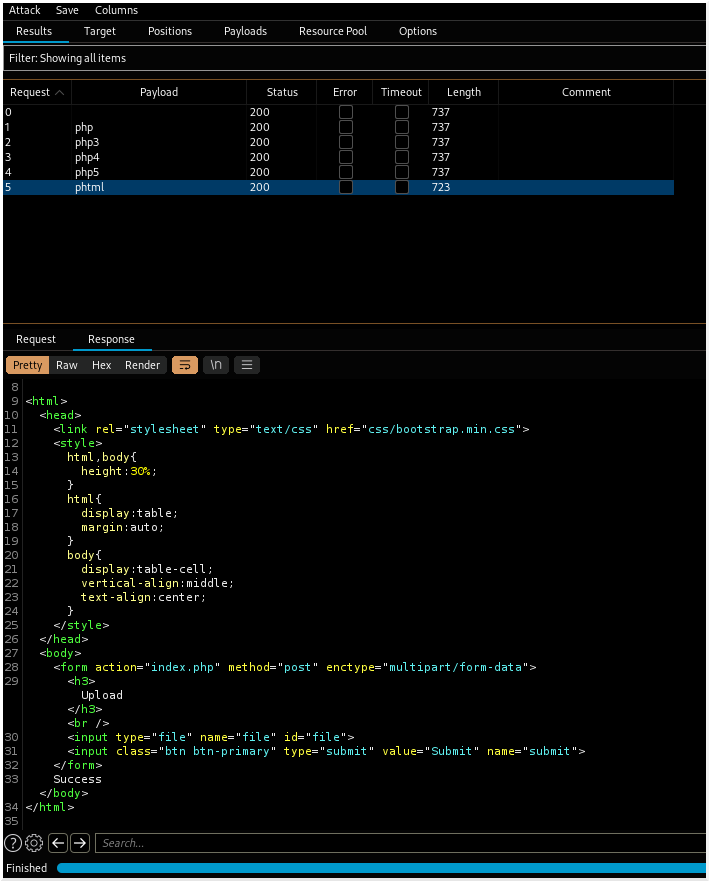
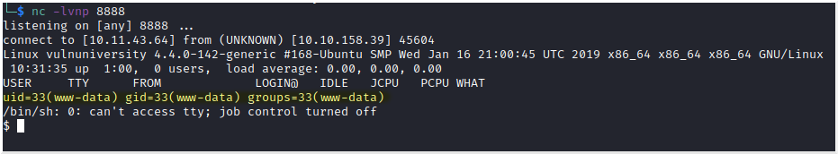
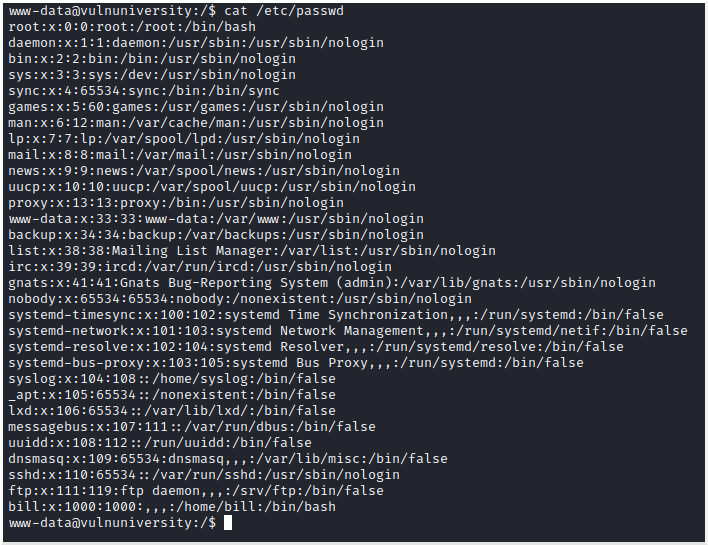
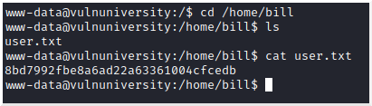
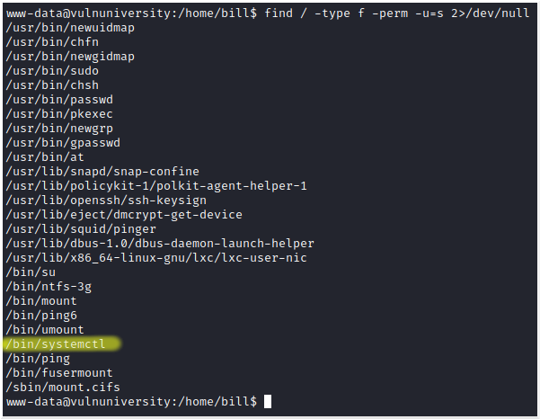
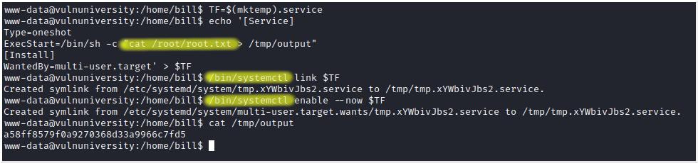

# Vulnversity
Target IP: 10.10.158.39

**Description**: Learn about active recon, web app attacks and privilege escalation.

## Reconnaissance
#### Scan the box, how many ports are open?
Do a quick scan of all ports, at this poins we just want to know which ones are open.


[nmap.out](./nmap.out)
The scan show that 6 ports are open.

**Answer**: 6

After a quick scan we want to do another scan, but this time dedicated to the ports we know are open. Running the NSE's default scans to this ports and getting the services versions.


[nmap_ext.out](./nmap_ext.out) 

#### What version of the squid proxy is running on the machine?
In the image above, we can see that Squid proxy is running on port 3128 with the version 3.5.12

**Answer**: 3.5.12

#### How many ports will nmap scan if the flag -p-400 was used?
**Answer**: 400

#### Using the nmap flag -n what will it not resolve?
**Answer**: DNS

#### What is the most likely operating system this machine is running?
If we take a look at SSH version in the image above, it says "Ubuntu Linux", we could also run nmap with the "-O" flag, this flag tries to determine what operating system is running on the host.

**Answer**: Ubuntu

#### What port is the web server running on?
Port 3333 is running Apache which is a web server.

**Answer**: 3333

#### Its important to ensure you are always doing your reconnaissance thoroughly before progressing. Knowing all open services (which can all be points of exploitation) is very important, don't forget that ports on a higher range might be open so always scan ports after 1000 (even if you leave scanning in the background)
**Answer**: No answer needed

## Locating directories using GoBuster
#### What is the directory that has an upload form page?




**Answer**: /internal/

## Compromise the webserver
#### Try upload a few file types to the server, what common extension seems to be blocked? 
We try a .php file and gives the error: "Extension not allowed"

**Answer**: .php

#### To identify which extensions are not blocked, we're going to fuzz the upload form. Run this attack, what extension is allowed?
Following the steps given, we were able to replicate the attack, and find a successful extension (.phtml), note that the response length for this one is different than the others.


**Answer**: .phtml

Now we rename our shell to have .phtml extension, upload it, open a listener and access the shell in the server at html://10.10.158.39:3333/internal/uploads/php-reverse-shell.phtml, and we get a reverse shell.


#### What is the name of the user who manages the webserver?
At first I thought it was *www-data* because that's the user we are when we get the reverse shell, meaning it was *www-data* who started the service. After I got it wrong, I proceeded to enumerate the users by reading the */etc/passwd* file and seeing that there's only one normal user called **bill**, the others are just the user root and services/default accounts.


**Answer**: bill

#### What is the user flag?


**Answer**:8bd7992fbe8a6ad22a63361004cfcedb

## Privilege Escalation
#### On the system, search for all SUID files. What file stands out?

```
find - to run the command find
/ - start the search in the root directory
-type f - search for regular files
-perm -u=s - files that have the bit SUID on
2>/dev/null - send the error outputs to /dev/null
```
systemctl is a tool to manage services that can be used by any user, so it's strange that has the SUID bit.

**Answer**: /bin/systemctl

#### Become root and get the last flag (/root/root.txt)
Go to https://gtfobins.github.io/gtfobins/systemctl/ to see how to exploit SUID permission on systemctl.


**Answer**: a58ff8579f0a9270368d33a9966c7fd5
