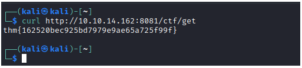
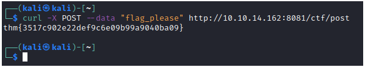
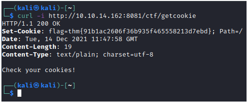
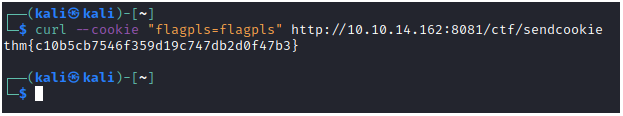

# Web Fundamentals

## Task 5: Mini CTF

**Tasks**</br>
There's a web server running on http://10.10.14.162:8081. Connect to it and get the flags!</br>
* GET request. Make a GET request to the web server with path /ctf/get
* POST request. Make a POST request with the body "flag_please" to /ctf/post
* Get a cookie. Make a GET request to /ctf/getcookie and check the cookie the server gives you
* Set a cookie. Set a cookie with name "flagpls" and value "flagpls" in your devtools (or with curl!) and make a GET request to /ctf/sendcookie

---

#### 1. What's the GET flag?

```
thm{162520bec925bd7979e9ae65a725f99f}
```
#### 2. What's the POST flag?

```
thm{3517c902e22def9c6e09b99a9040ba09}
```
#### 3. What's the "Get a cookie" flag?


**-i** is to **include** protocol headers in the output.
```
thm{91b1ac2606f36b935f465558213d7ebd}
```

#### 4. What's the "Set a cookie" flag?

```
thm{c10b5cb7546f359d19c747db2d0f47b3}
```
